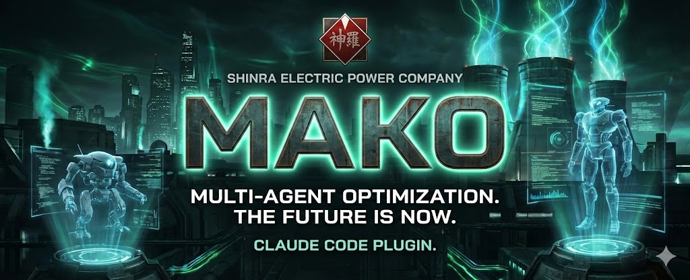

# MAKO AI Agents

> Modular Agent Kit for Orchestration -- 13 specialized AI agents for Claude Code, embodying Shinra Electric Power Company personalities.

## What is MAKO?

MAKO is a multi-agent system for **Claude Code** that transforms a solo developer into a full engineering team. Each agent is a specialized persona from the Shinra Electric Power Company (Final Fantasy VII), covering every phase of the software development lifecycle: discovery, architecture, scaffolding, implementation (TDD), testing, security, documentation, and adversarial code review.

## Why MAKO?

Claude Code is powerful, but a single prompt cannot enforce consistent quality across an entire project lifecycle. MAKO solves this by decomposing the SDLC into specialized agents with clear responsibilities, quality gates, and an orchestrator (Rufus) that routes tasks to the right expert at the right time.

## Quick Start

```bash
# Add the Shinra Marketplace
/plugin marketplace add git@github.com:Mister-Wolfgang/shinra-marketplace.git

# Install MAKO
/plugin install mako@shinra-marketplace
```

## Agents

| Agent | Character | Role | Model |
| --- | --- | --- | --- |
| **Rufus Shinra** | President | **Orchestrator** -- Commands, delegates, coordinates. | -- |
| **Tseng** | Head of the Turks | **Analyzer** -- Project scan and `project-context.md`. | Sonnet |
| **Scarlet** | Director of Weapons | **Discovery** -- Requirements analysis and Quality Tiering. | Sonnet |
| **Genesis** | SOLDIER 1st Class | **UX/Design Lead** -- Interfaces and Design Systems. | Sonnet |
| **Reeve** | Engineer | **Architect** -- Epics, Stories, and ADRs. | Sonnet |
| **Heidegger** | Director of Security | **Scaffold** -- File structure and boilerplate. | Haiku |
| **Lazard** | Director of SOLDIER | **DevOps/CI-CD** -- Pipelines, Docker, Infrastructure. | Haiku |
| **Hojo** | Head of Science | **Implementor** -- Code via TDD (Red -> Green -> Refactor). | Opus |
| **Reno** | Turk | **Tester (Speed)** -- Unit and integration tests. | Sonnet |
| **Elena** | Turk (Rookie) | **Tester (Deep)** -- Security, edge cases, stress tests. | Sonnet |
| **Palmer** | Director of Space | **Documenter** -- Technical and API documentation. | Sonnet |
| **Rude** | Turk | **Reviewer** -- Adversarial review and spec validation. | Sonnet |
| **Sephiroth** | The One-Winged Angel | **Debugger** -- Critical diagnosis (locked by default). | Opus |
| **Lucrecia** | Scientist | **Meta-learning** -- Plugin and prompt guardian. | Opus |

## Skills (Slash Commands)

| Command | Description |
| --- | --- |
| `/mako:create-project` | Full pipeline from discovery to documentation for a new project. |
| `/mako:modify-project` | Impact analysis (Tseng) and safe modification. |
| `/mako:add-feature` | Add a feature with alignment validation. |
| `/mako:fix-bug` | Sephiroth diagnosis and iterative fix. |
| `/mako:refactor` | Architectural restructuring via Reeve & Hojo. |
| `/mako:brainstorm` | Multi-perspective debate (Party Mode). |
| `/mako:onboard` | Deep scan (Brownfield) and sprint initialization. |
| `/mako:qa-audit` | Full coverage audit and regression tests. |
| `/mako:correct-course` | Mid-sprint course correction. |
| `/mako:rust-security` | Rust-specific security audit. |

## Architecture

### Quality Tiers

Automatic rigor adaptation based on the chosen tier:

- **Essential** -- Structure + Linter + Basic unit tests.
- **Standard** -- CI + Pre-commit + Error scenarios.
- **Comprehensive** -- Docker + Coverage + E2E + ADRs.
- **Production-Ready** -- Security audit + Chaos engineering + Runbooks.

### TDD Protocol

Strict implementation enforced by Hojo:

1. **Red** -- Write a failing test.
2. **Green** -- Minimal code to pass.
3. **Refactor** -- Optimize under Rude's review.

### Definition of Done Gate

6 categories adapted to quality tier: **Code**, **Tests** (50-90% coverage by tier), **Review**, **Docs**, **Regression**, **Runtime** (strict linter, smoke test, visual verification).

## Project Structure

```text
mako-ai-agents/
├── .claude-plugin/
│   └── plugin.json          # Plugin metadata and version
├── .github/
│   └── workflows/ci.yml     # CI pipeline
├── agents/                   # Markdown definitions for all 13 agents
│   ├── elena.md
│   ├── genesis.md
│   ├── heidegger.md
│   ├── hojo.md
│   ├── lazard.md
│   ├── lucrecia.md
│   ├── palmer.md
│   ├── reeve.md
│   ├── reno.md
│   ├── rude.md
│   ├── scarlet.md
│   ├── sephiroth.md
│   └── tseng.md
├── context/                  # Orchestrator logic and guides
│   ├── elicitation-library.md
│   ├── rufus-memory-guide.md
│   └── rufus.md
├── contracts/                # JSON schemas (I/O, Telemetry)
├── docs/adr/                 # Architecture Decision Records
├── hooks/                    # Event hooks (JS) and tests (Vitest)
│   ├── __tests__/
│   ├── lib/
│   └── *.js
├── scripts/
│   └── health-check.js
├── skills/                   # Slash command definitions
│   ├── add-feature/
│   ├── brainstorm/
│   ├── correct-course/
│   ├── create-project/
│   ├── fix-bug/
│   ├── modify-project/
│   ├── onboard/
│   ├── qa-audit/
│   ├── refactor/
│   └── rust-security/
├── logo.jpg
├── package.json
├── vitest.config.js
└── README.md
```

## Changelog

### v1.1.0 -- Hooks Fix & Performance

- **Fix**: `.mcp.json` now written to `~/.mcp.json` (home directory) instead of plugin cache; merges with existing `mcpServers` config
- **Fix**: Remove `<system-reminder>` double-wrapping in `user-prompt-submit-rufus.js` (framework handles injection)
- **Fix**: Improved Python detection on Windows (`py -3` launcher tried first, avoids Windows Store stubs)
- **Perf**: Python detection result cached in `~/.shinra/python-cache.json` (24h TTL), eliminating repeated `execSync` calls
- **Perf**: Removed synchronous HTTP health check from `SessionStart` hook (MCP service not yet started at that stage); runtime fallback handled by individual hooks

### v1.0.0 -- Initial Release

- 13 specialized AI agents for full project lifecycle
- 10 slash commands (skills)
- Event-driven hooks system
- Quality tier adaptation (Essential -> Production-Ready)
- TDD-first implementation protocol
- Adversarial review pipeline
- Definition of Done gate with 6 categories
